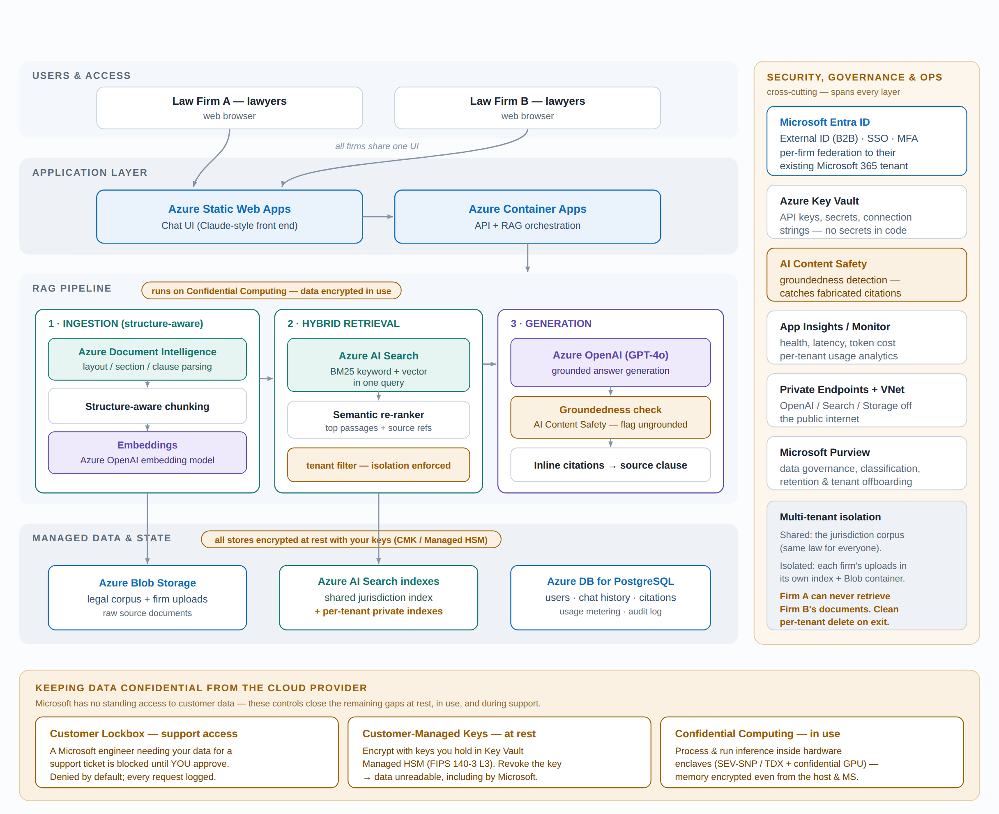

# Legal RAG Platform

A retrieval-augmented legal assistant scoped to the laws, orders, and regulations of specific offshore jurisdictions. Structure-aware ingestion, hybrid retrieval, and grounded generative answers with citations back to the source instrument.

This document describes the target architecture for taking the platform from a single-user tool to a **multi-tenant commercial product** running on Microsoft Azure.

---

## Why Azure

The platform handles confidential legal material for law firms. The two questions a firm's risk/procurement team will ask on day one are *"where does our data go?"* and *"does anyone train on it?"* — Azure OpenAI answers both cleanly (region-pinned data residency, contractual no-training on customer data, enterprise SLAs), and the rest of the stack sits behind it as managed services. Firms also overwhelmingly run on Microsoft 365, so identity federation is the path of least resistance.

---

## Architecture at a glance

*Request flows top to bottom (users → app → RAG pipeline → managed data); security, governance, and the multi-tenant isolation model run cross-cutting on the right. The bottom band shows the controls that keep data confidential from the cloud provider (see Data security & confidentiality).*

---

## Component mapping

| Concern | Azure service | Notes |
|---|---|---|
| Generative answers | **Azure OpenAI** (GPT-4o class) | No training on your data; region-pinnable. The anchor of the stack for a legal product. |
| Hybrid retrieval | **Azure AI Search** | BM25 keyword + vector in a single query, plus a semantic re-ranker. This *is* your hybrid retrieval — may retire custom retrieval code. |
| Structure-aware ingestion | **Azure Document Intelligence** | Layout model extracts headings, sections, clauses, and reading order so chunking follows real structural boundaries. |
| Embeddings | **Azure OpenAI** (embedding model) | Vectorize chunks at ingest time. |
| Source document store | **Azure Blob Storage** | Raw legal corpus + per-firm uploads. |
| App state | **Azure Database for PostgreSQL** | Users, chat history, saved citations, per-tenant usage metering, audit log. |
| UI | **Azure Static Web Apps** | The Claude-style front end. |
| API / orchestration | **Azure Container Apps** | Scales to zero; less overhead than AKS, more flexibility than App Service. |
| Identity | **Microsoft Entra ID (External ID)** | SSO, MFA, and federation to each firm's existing M365 tenant. |
| Secrets | **Azure Key Vault** | No secrets in code or config. |
| Networking | **Private Endpoints + VNet** | Keep OpenAI / Search / Storage off the public internet. |
| Governance | **Microsoft Purview** | Classification, retention, clean tenant offboarding. |
| Observability | **Application Insights / Azure Monitor** | Health, latency, token cost, per-tenant usage analytics. |

---

## Multi-tenancy

The single biggest change from personal tool to product. For legal data, tenant isolation is non-negotiable — **Firm A must never retrieve Firm B's uploaded documents.**

- **Shared** — the jurisdiction corpus (laws, orders, regulations) lives in one shared index. It's the same public legal content for every customer and it's the core value of the product.
- **Isolated** — anything a firm uploads (memos, matter files, annotations) is scoped to that firm. Preferred approach is **index-per-tenant** in AI Search + a per-tenant Blob container, rather than a single index with tenant-ID filters. Physical isolation is easier to defend in a security questionnaire and gives you a clean per-tenant delete on offboarding.

Every retrieval query is server-side scoped to the caller's tenant; the client never chooses which index it reads.

---

## Groundedness (the part that separates a toy from a legal product)

A lawyer acting on a fabricated citation is a real liability event. Hallucination control is a first-class feature here, not a nice-to-have:

1. **Groundedness detection** — run every answer through **Azure AI Content Safety**'s groundedness API to flag claims not supported by the retrieved passages; suppress or annotate ungrounded output.
2. **Mandatory inline citations** — every assertion links to the exact source clause it came from, with click-through to the retrieved text. Lawyers should never trust an answer they can't verify against the primary source.
3. **Full audit trail** — log query, retrieval set, and response for every interaction (debugging + firms will want it).

---

## Data security & confidentiality

The platform holds privileged legal material, so *"can the cloud provider read our clients' data?"* is a first-order question. The realistic target is not a mathematical guarantee against a determined provider (only self-hosting achieves that, at a cost usually worse than the risk) but **reasonable, layered safeguards that satisfy professional confidentiality obligations.** By default Microsoft engineers have *no* standing access to customer data — data at rest is encrypted, and any support-time access is just-in-time, time-boxed, and logged. The controls below close the remaining gaps, at rest, in use, and during support (they map to the bottom band of the architecture diagram).

**1. Customer Lockbox — control support access.**
Turned on, Customer Lockbox puts *us* in the approval loop: if a Microsoft engineer ever needs access to our data to service a support ticket, the request is blocked until we explicitly approve it, and every request is logged. Without approval, no access.

**2. Customer-Managed Keys (CMK) — hold our own keys (protects data at rest).**
Instead of Microsoft-managed encryption keys, encrypt data at rest with keys we generate and control in **Azure Key Vault Managed HSM** (FIPS 140-3 Level 3; key material is non-exportable, even by Microsoft). Disable or revoke the key and the data is unreadable to everyone, including Microsoft. Applies to Blob Storage, Azure AI Search, Azure Database for PostgreSQL, and Azure OpenAI stored data.

**3. Confidential Computing — protect data in use (the RAG-specific gap).**
Encryption at rest protects data while stored, but to index, embed, search, and generate, the data must be *decrypted in memory* — that in-use moment is the real exposure. Run the orchestration and inference path on **confidential VMs / containers** (AMD SEV-SNP / Intel TDX) and **confidential GPUs** (NVIDIA H100), optionally via **Azure AI confidential inferencing**, so memory stays hardware-encrypted and attested even from the host hypervisor and Microsoft operators.

**4. Client-side encryption — strongest, but limited here.**
Encrypting data before it reaches Azure means the provider only ever sees ciphertext — but you cannot search, embed, or retrieve over ciphertext, so this only fits cold storage of un-indexed uploads, not the live searchable corpus. Noted for completeness; not a general solution for a RAG system.

**Contractual layer.**
Pair the technical controls with the **Data Processing Agreement**: Azure OpenAI contractually commits to *not* training on customer data; pin **data residency** to the required region; and document access terms. Give each firm a short **security one-pager** describing exactly these controls — *"how do we know Microsoft can't read our clients' files?"* is the first question a firm's risk partner will ask.

**Recommended baseline for this product:** Customer Lockbox **on** + CMK backed by **Managed HSM** + **Confidential Computing** on the processing/inference path + full audit logging. Net effect: Microsoft cannot read the data at rest without our keys, cannot access it in memory during processing, and cannot obtain support access without our sign-off — stronger than what most firms' own on-prem servers achieve.

---

## Suggested build phases

**Phase 1 — Paid pilot (one firm)**
Entra sign-in, single shared jurisdiction index, Container Apps API, Azure OpenAI generation with citations + groundedness check, Blob + PostgreSQL, App Insights. No per-tenant uploads yet.

**Phase 2 — Multi-tenant**
Per-tenant indexes and Blob containers, firm-level admin, usage metering + billing, private endpoints, Purview governance.

**Phase 3 — Scale & harden**
Provisioned Throughput for OpenAI if load justifies, SSO federation per firm, SOC2-style controls, tenant self-service onboarding/offboarding. Turn on the full confidentiality baseline (Customer Lockbox, CMK/Managed HSM, Confidential Computing) here if not sooner.

---

## Rough cost shape

At low volume (a handful of firms) the meaningful spend is:

- **Azure OpenAI** — usage-driven (tokens); the main variable cost.
- **Azure AI Search** — ~$250/mo for a production-tier index, scaling with tenants.
- Everything else (Container Apps, Static Web Apps, PostgreSQL, storage) is small at pilot scale.

Note: **Managed HSM** and **Confidential Computing** carry a premium (dedicated HSM pool; confidential-GPU SKUs cost more than standard) — factor these in when the confidentiality baseline is switched on.

---

## ⚠️ Non-technical gates — resolve before building

These can reshape or kill the product independently of the tech, so treat them as blockers, not footnotes:

1. **Content licensing.** The platform commercially *redistributes* the laws, orders, and regulations of these jurisdictions. Primary legislation is often free to reproduce, but consolidated/annotated versions and official gazettes may be Crown-copyright or licensed. Confirm the right to serve this content for money.
2. **Professional liability.** Once money changes hands, "helpful side project" becomes "tool firms rely on." Put clear *"not legal advice / verify against source"* terms in place, and get a conversation going about professional-indemnity cover.

---

*Architecture reference — not a commitment to a specific implementation. Service choices (e.g. PostgreSQL vs. Cosmos DB, Container Apps vs. App Service) are starting recommendations, not requirements.*
